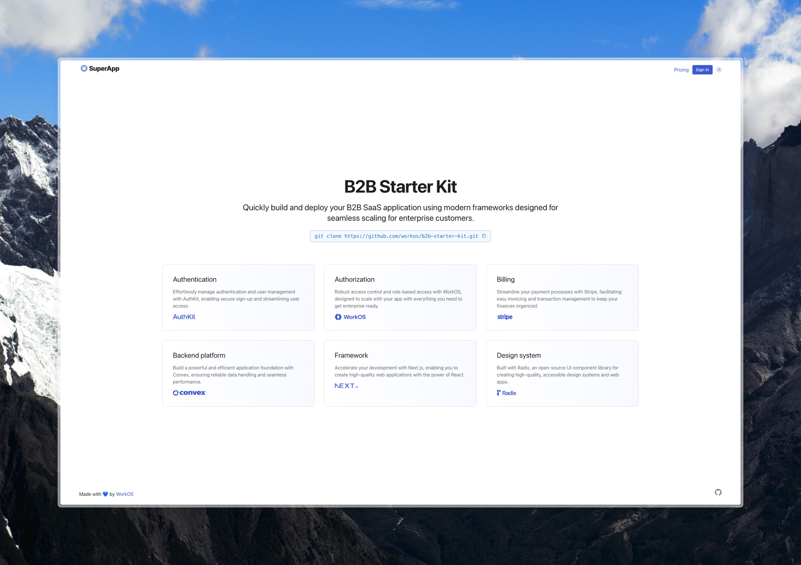

<p align="center">
  
  <h1 align="center">Next.js B2B Starter Kit</h1>
</p>

<p align="center">
  A fully functional B2B SaaS template built with Next.js, Stripe, Convex, and WorkOS.
</p>

<p align="center">
  <a href="https://opensource.org/licenses/MIT">
    
  </a>
  <a href="https://next-b2b-starter-kit.vercel.app/">
    
  </a>
</p>

<p align="center">
  Demo: <a href="https://next-b2b-starter-kit.vercel.app/">https://next-b2b-starter-kit.vercel.app/</a>
</p>

<p align="center">
  Read about the <a href="https://workos.com/blog/nextjs-b2b-starter-kit">Next.js B2B Starter Kit</a> on the WorkOS blog.
</p>

## Features

- Marketing splash page (`/`)
- Pricing page (`/pricing`) which allows signed in users to subscribe via Stripe Checkout
- Dashboard page (`/dashboard`) which is only accessible to admin users. Includes CRUD for users, audit logs and configuring SSO and billing
- Product page (`/product`) which is only accessible to signed in users
- Role-based access control
- Audit logs
- Billing
- Webhook syncing to Convex

## Getting started

### Prerequisites

You'll need a [Convex](https://www.convex.dev/) account, a [Stripe](https://stripe.com/) account and a [WorkOS](https://workos.com/) account.

### Clone the repo

```bash
git clone https://github.com/workos/next-b2b-starter-kit.git
```

### Navigate to the project directory

```bash
cd next-b2b-starter-kit
```

### Install dependencies

```bash
pnpm install
```

### Run the setup script

```bash
pnpm run setup
```

### Start the development server

```bash
pnpm run dev
```

## Tech stack

- Framework: Next.js
- Database: Convex
- Authentication: AuthKit by WorkOS
- Payments: Stripe

## App flow

After viewing your marketing splash page (`/`) and pricing page (`/pricing`), users sign up before choosing a plan. This is so we can create an organization and link it to a Stripe customer.

Once signed up, users with the "admin" role can access the dashboard (`/dashboard`) where they can manage users, configure SSO and billing, and view audit logs. Note that in the default example, audit logs are only accessible when subscribed to the "Enterprise" plan.

Users without the "admin" role are instead redirected to the product page (`/product`) where they can interact with your product.

## Testing

When running locally or using the deployed [demo app](https://b2b-starter-kit.vercel.app/), use the following test card numbers for the Stripe Checkout flow:

- Card number: 4242 4242 4242 4242
- CVC: Any 3 digits
- Expiration Date: Any future date
- ZIP: Any 5 digits

## Deploying

Once you're ready to deploy your app, refer to the [Convex documentation](https://docs.convex.dev/production) for instructions on deploying to hosted solutions like Vercel.

Remember to use your production API keys for both Stripe and WorkOS before deploying to production.

## Need to Sync more data?

Learn more about the syncing system that connects [AuthKit](https://www.authkit.com/) and [Convex](https://www.convex.dev/).

We made a short video series that covers the full integration.
Check it out on [YouTube](https://youtu.be/GGwBSu0XmP0?feature=shared).

[](https://youtu.be/GGwBSu0XmP0?feature=shared)
